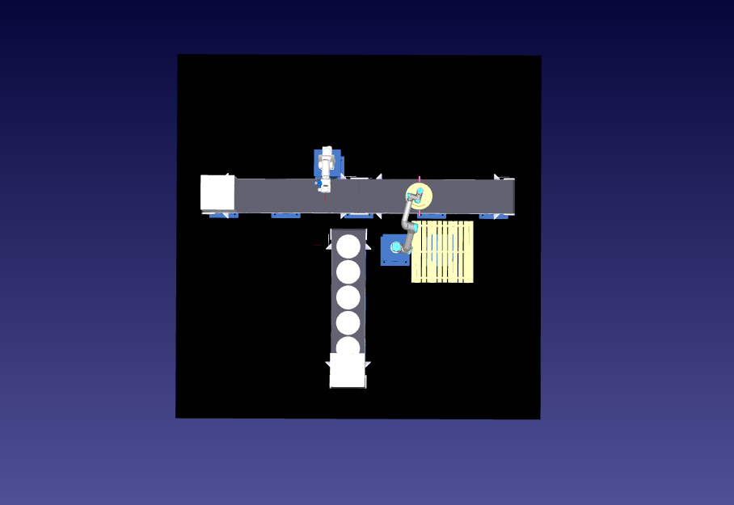

# PR2_GRUPO4
Este es el repositorio donde vamos a subir y actualizar los códigos utilizados en la asignatura de proyecto relacionado con RoboDK, MQTT, SQL ...

  

### Miembros del proyecto

- Cesar Lozano Grau  
- Pablo Llopis Sampedro  
- Joseba Nares Villanueva  
- Jaume Gimeno Ponz
- Paula Carcel Vércher
